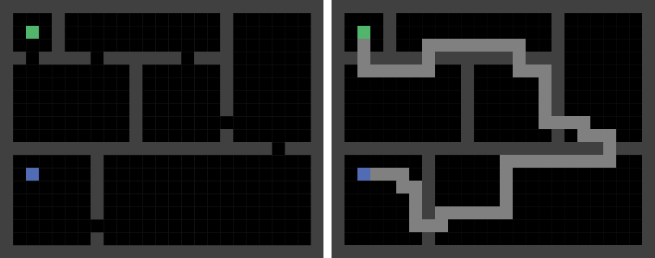
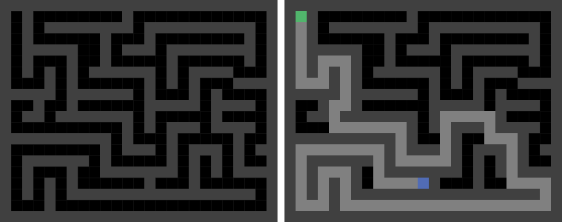

# shortest-path
A small side project for some use in other projects that might need some sort of path finding. Currently, only dijkstra's shortest path algorithm is implemented.

## Motivation
A lot of times, games that I develop are based on some sort of a 2D grid. Currently I am developing a FPS raycaster game (like [Wolfenstein3D](https://github.com/id-Software/wolf3d)) and the enemies should follow the player when the player gets inside their field of view. I prefer to isolate suff like this, because it is much easier to test and play around with the code and not being dependent on the project I am currently working on. This helps in reusing code as well.

## Compiling
In order to compile the application you need SDL2. Have a look insinde the [premake5.lua](premake5.lua) file to find out what paths are actually used. Currently the target platform is only Windows. Some small changes need to be made in order to run the code on macOS or Linux.

## Controls
Use the mouse cursor to draw onto the grid.
To enter differnet modes, use the following keys
- [1] draw wall
- [2] draw start node
- [3] draw end node
- [e] eraser
- [c] clear
- [r] reset path
- [Space] draw shortest path